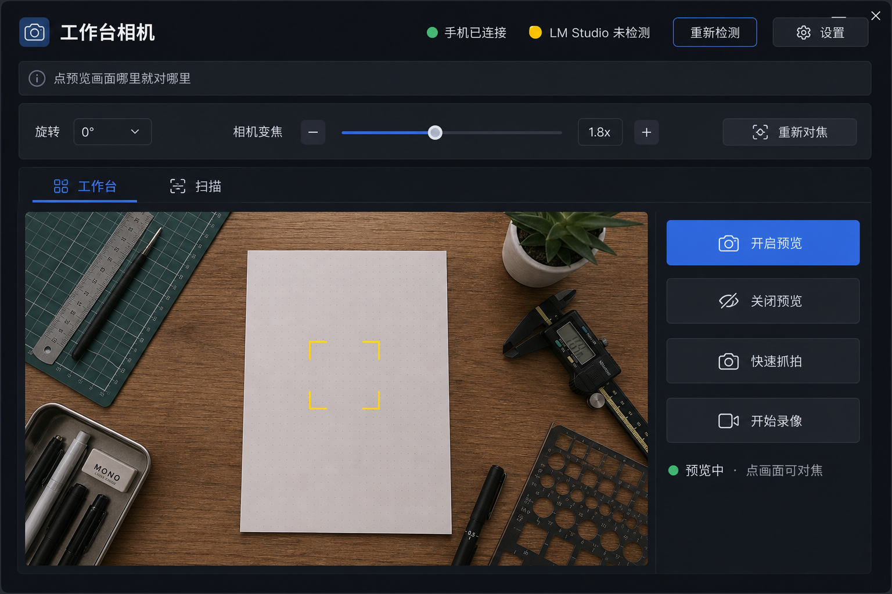
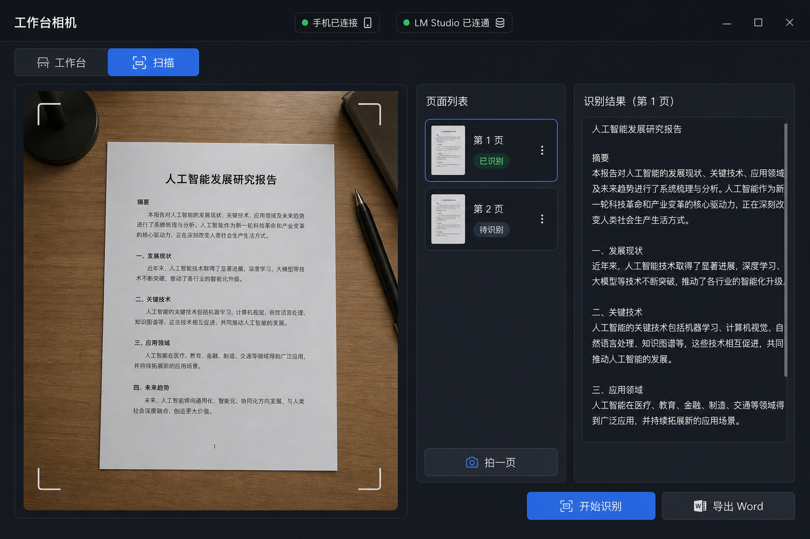

# 工作台相机

[English](README.md) · [简体中文](README.zh-CN.md)

[](LICENSE)
[](https://www.python.org/)
[](https://github.com/mercury666cn/workbench-camera)
[](requirements.txt)

把任意安卓手机的后置镜头，变成 Windows 上的工作台 / 文档相机。实时预览、真变焦、点哪对哪、抓拍录像、连扫，可选 OCR。手机不用装 App。


## 功能

- USB 后置预览，不是镜像手机桌面
- 相机变焦，点预览画面哪里就对哪里
- 抓拍、录像、多页连扫
- 可选接到你自己的 LM Studio 做识别

## 界面

下面是按软件风格做的示意，不是像素级截图。

<table>
  <tr>
    <td align="center" width="50%">
      
      <br />
      <sub>工作台 — 预览、变焦、点选对焦、抓拍</sub>
    </td>
    <td align="center" width="50%">
      
      <br />
      <sub>扫描 — 分页、识别、导出 Word</sub>
    </td>
  </tr>
</table>

## 快速开始

1. 手机打开 **开发者选项 → USB 调试**，插上电脑，如有提示就允许这台电脑调试。
2. 双击 `run.bat`。第一次会建虚拟环境、装依赖，并下载 [scrcpy](https://github.com/Genymobile/scrcpy) 4.1（自带 ADB）。
3. 点 **开启预览**。点画面可以对焦，拖拉条可以变焦。

```bat
python -m venv .venv
.venv\Scripts\pip install -r requirements.txt
.venv\Scripts\python -m app
```

**PySide6 必须锁 `6.8.3`。** 更新的版本（例如 6.11）在 Windows 10 上可能 DLL 加载失败。

文件默认保存在 `文档\工作台相机`。

## 环境

- Windows 10 或更新
- Python 3.11 或更新
- 安卓手机，打开 USB 调试
- 能传数据的 USB 线（不要只能充电的线）

## 用法

| 操作 | 作用 |
| --- | --- |
| 点预览画面 | 对你点的那一块找焦（工作台 / 扫描都算） |
| 重新对焦 | 对画面中心再找一次，**不重启取流** |
| 变焦拉条 | 相机变焦，预览中即时生效 |
| 旋转 | 只转电脑上的画面（点击坐标会还原到相机原图） |
| 扫描 | 连拍多页，设好 LM Studio 后可识别 |

### 可选：LM Studio OCR

预览、变焦、对焦、抓拍、录像可以单独用，OCR 不是必须的。

1. 打开 LM Studio，加载一个带视觉能力的模型。
2. 打开本地服务（默认 `http://127.0.0.1:1234/v1`）。
3. 如果服务在另一台电脑上，让它监听局域网，并在软件「设置」里填那个地址。

## 原理

电脑通过 ADB 把打过补丁的 scrcpy 4.1 server 推到手机（不安装成手机应用），和变焦走同一条 Camera2 会话。

```
手机镜头  --USB/ADB-->  补丁 scrcpy-server  -->  本 Windows 软件
```

协议仍是官方 scrcpy 4.1。下载官方 Windows 压缩包之后，软件会再拷回 `tools/vendor/scrcpy-server`，点选对焦才会在。

## 已知限制

- 部分华为机会在强制熄屏，或预览中跑 `dumpsys media.camera` 时把 USB 打成 `offline`。掉线了就拔线等几秒再插，不要连点重新检测。
- Camera2 **LIMITED** 机型的连续对焦会比官方相机 App 弱一截。
- 这不是投屏，也不是 IP Webcam。

## 致谢

取流基于 Genymobile 的 [scrcpy](https://github.com/Genymobile/scrcpy)（Apache-2.0）。本项目对 server 做了连续自动对焦和点选对焦的小补丁。

## 许可

[Apache License 2.0](LICENSE)
